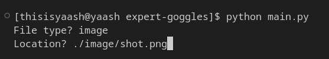

# expert-goggles
A **novice-friendly** project while learning along the way. It's all about understanding images better, focusing on image processing. 
## Implementation
To perform basic ***OCR*** using good quality images.
1. run `main.py` 
```bash
python main.py
```
---
2. Enter *File Type*


---
3. Enter *File Directory Location*



---
4. Press Enter, then the results will be displayed in command prompt

